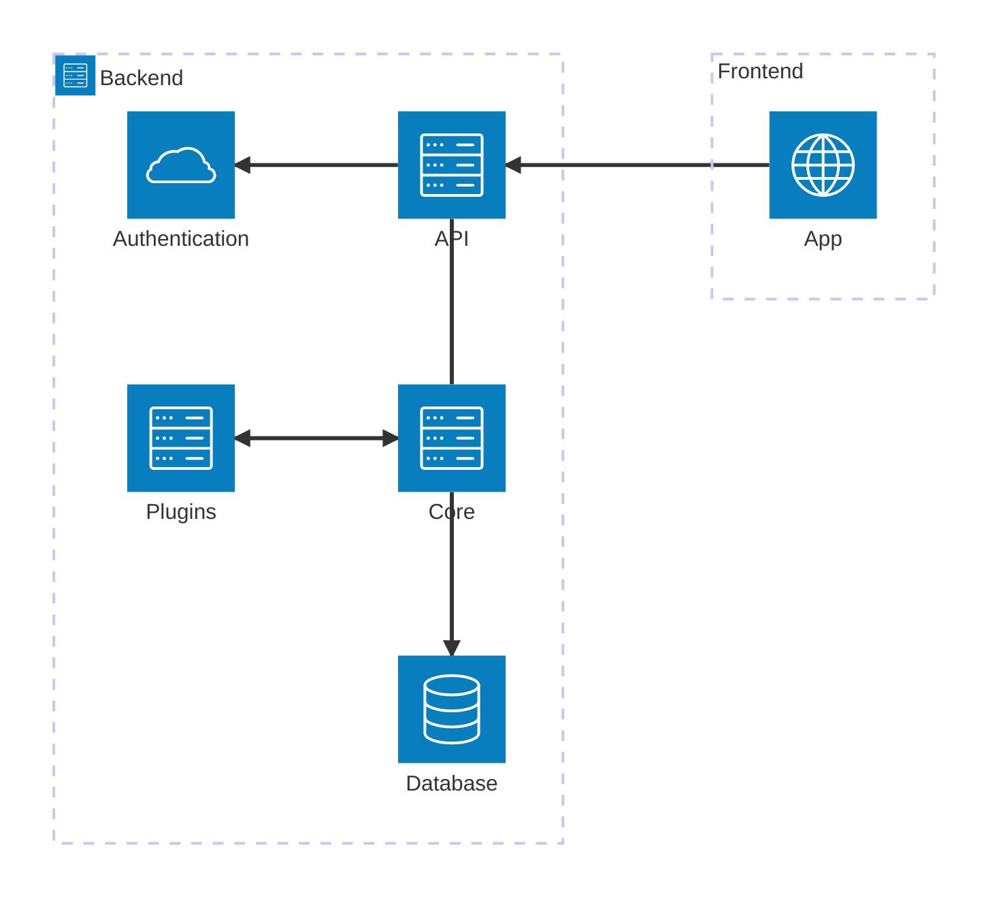

## Architecture

```mermaid
architecture-beta
    group back(server)[Backend]
    service db(database)[Database] in back
    service auth(cloud)[Authentication] in back
    service api(server)[API] in back
    service core(server)[Core] in back
    service plugins(server)[Plugins] in back

    api:L --> R:auth
    api:B -- T:core
    core:B --> T:db
    plugins:R <--> L:core

    group front[Frontend]
    service app(internet)[App] in front

    api:R <-- L:app

```
