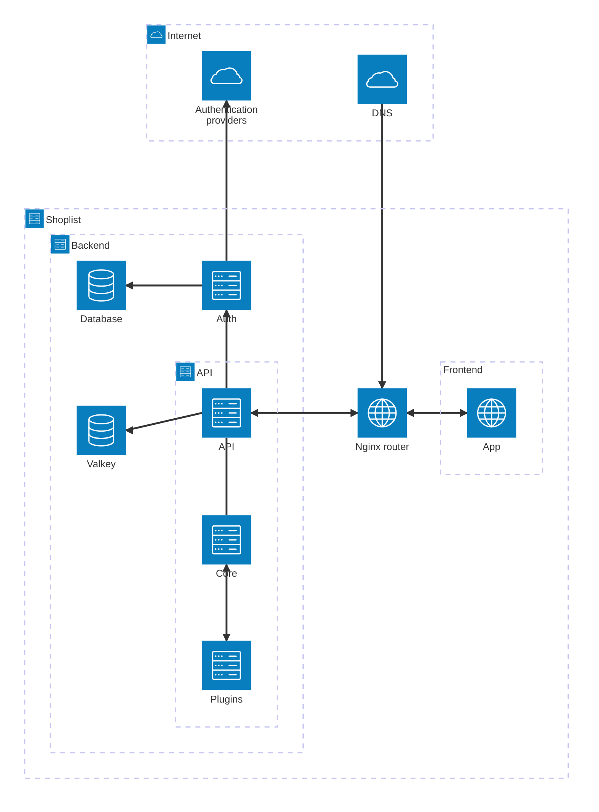

## Architecture

```mermaid
architecture-beta
    group shoplist(server)[Shoplist]
    service nginx(internet)[Nginx router] in shoplist

    group internet(cloud)[Internet]
    service internetAuth(cloud)[Authentication providers] in internet
    service dns(cloud)[DNS] in internet
    dns:B --> T:nginx

    group back(server)[Backend] in shoplist
    service valkey(database)[Valkey] in back
    service db(database)[Database] in back
    service auth(server)[Auth] in back

    group apigroup(server)[API] in back
    service api(server)[API] in apigroup
    service core(server)[Core] in apigroup
    service plugins(server)[Plugins] in apigroup

    api:L --> R:valkey
    api:T --> B:auth
    auth:L --> R:db
    api:B -- T:core
    plugins:T <--> B:core
    auth:T --> B:internetAuth

    group front[Frontend] in shoplist
    service app(internet)[App] in front

    api:R <--> L:nginx
    nginx:R <--> L:app
```
