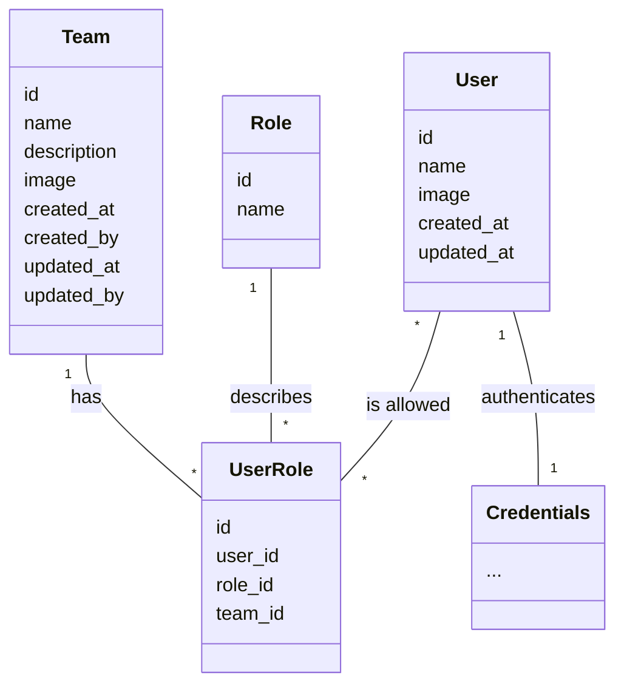

## DB Model

```mermaid
classDiagram
    class Team {
        id
        name
        description
        image
        created_at
        created_by
        updated_at
        updated_by
    }

    class Role {
        id
        name
    }

    class User {
        id
        name
        image
        created_at
        updated_at
    }

    class UserRole {
        id
        user_id
        role_id
        team_id
    }

    Team "1" -- "*" UserRole : has
    User "*" -- "*" UserRole : is allowed
    Role "1" -- "*" UserRole : describes

    class Credentials {
        ...
    }

    User "1" -- "1" Credentials : authenticates

```
