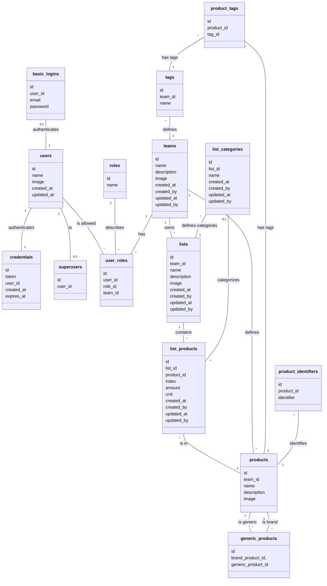

## DB Model

```mermaid
classDiagram
    class teams {
        id
        name
        description
        image
        created_at
        created_by
        updated_at
        updated_by
    }

    class credentials {
        id
        token
        user_id
        created_at
        expires_at
    }

    class basic_logins {
        id
        user_id
        email
        password
    }

    basic_logins "0,1" -- "1" users : authenticates

    class users {
        id
        name
        image
        created_at
        updated_at
    }

    class superusers {
        id
        user_id
    }

    users "1" -- "0,1" superusers : is

    class roles {
        id
        name
    }

    class user_roles {
        id
        user_id
        role_id
        team_id
    }

    users "*" -- "*" user_roles : is allowed
    roles "1" -- "*" user_roles : describes
    teams "1" -- "*" user_roles : has
    users "1" -- "1" credentials : authenticates

    class lists {
        id
        team_id
        name
        description
        image
        created_at
        created_by
        updated_at
        updated_by
    }

    teams "1" -- "*" lists : owns

    class list_products {
        id
        list_id
        product_id
        index
        amount
        unit
        created_at
        created_by
        updated_at
        updated_by
    }

    lists "1" -- "*" list_products : contains
    list_products "*" -- "1" products : is in


    class list_categories {
        id
        list_id
        name
        created_at
        created_by
        updated_at
        updated_by
    }

    list_categories "0,1" -- "*" list_products : categorizes
    list_categories "*" -- "1" lists : defines-categories

    class products {
        id
        team_id
        name
        description
        image
    }

    teams "1" -- "*" products : defines

    class generic_products {
        id
        brand_product_id,
        generic_product_id
    }

    products "1" -- "*" generic_products : is generic
    generic_products "*" -- "1" products : is brand

    class tags {
        id
        team_id
        name
    }

    class product_tags {
        id
        product_id
        tag_id
    }

    product_tags "*" -- "1" products : has tags
    product_tags "*" -- "1" tags : has tags
    tags "*" -- "1" teams: defines

    class product_identifiers {
        id
        product_id
        identifier
    }

    product_identifiers "*" -- "1" products : identifies


```
