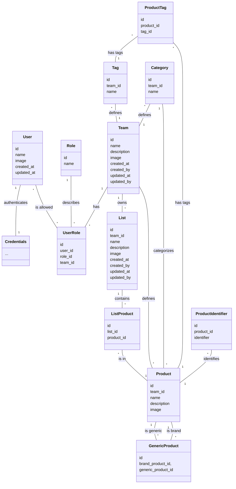

## DB Model

```mermaid
classDiagram
    class Team {
        id
        name
        description
        image
        created_at
        created_by
        updated_at
        updated_by
    }

    class Credentials {
        ...
    }

    class User {
        id
        name
        image
        created_at
        updated_at
    }

    class Role {
        id
        name
    }

    class UserRole {
        id
        user_id
        role_id
        team_id
    }

    User "*" -- "*" UserRole : is allowed
    Role "1" -- "*" UserRole : describes
    Team "1" -- "*" UserRole : has
    User "1" -- "1" Credentials : authenticates

    class List {
        id
        team_id
        name
        description
        image
        created_at
        created_by
        updated_at
        updated_by
    }

    Team "1" -- "*" List : owns

    class ListProduct {
        id
        list_id
        product_id
    }

    List "1" -- "*" ListProduct : contains
    ListProduct "*" -- "1" Product : is in

    class Product {
        id
        team_id
        name
        description
        image
    }

    Team "1" -- "*" Product : defines

    class GenericProduct {
        id
        brand_product_id,
        generic_product_id
    }

    Product "1" -- "*" GenericProduct : is generic
    GenericProduct "*" -- "1" Product : is brand

    class Category {
        id
        team_id
        name
    }

    Category "1" -- "*" Product : categorizes

    class Tag {
        id
        team_id
        name
    }

    class ProductTag {
        id
        product_id
        tag_id
    }

    ProductTag "*" -- "1" Product : has tags
    ProductTag "*" -- "1" Tag : has tags
    Tag "*" -- "1" Team: defines
    Category "*" -- "1" Team : defines

    class ProductIdentifier {
        id
        product_id
        identifier
    }

    ProductIdentifier "*" -- "1" Product : identifies


```
